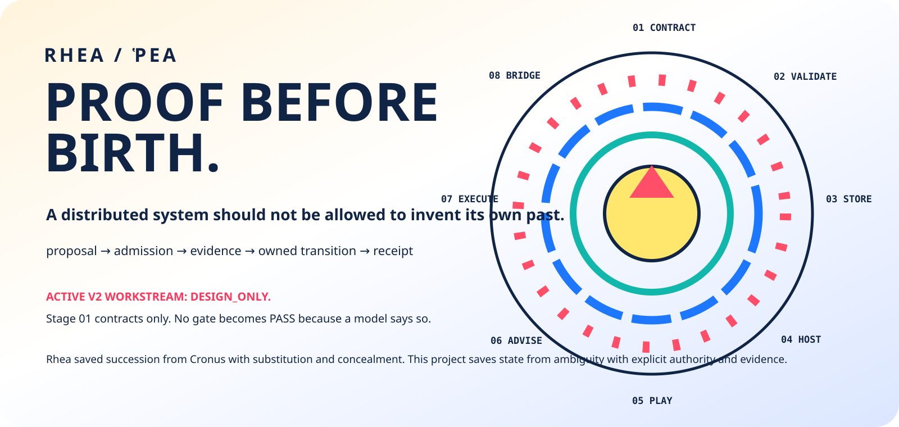

<p align="center">
  
</p>

<h1 align="center">RHEA / ῬΕΑ</h1>
<p align="center"><strong>PROOF BEFORE BIRTH.</strong></p>
<p align="center"><em>A distributed system should not be allowed to invent its own past.</em></p>

<p align="center">
  <a href="https://github.com/timelabs-npo/rhea-project/tree/rhea-project-v2">Active v2 workstream</a> ·
  <a href="https://blueshoes.space/rhea/">Rhea Pantheon</a> ·
  <a href="https://github.com/timelabs-npo/rhea-project/blob/75cb31e59ccc4f436a428811cb70bbc495254821/README.md">Legacy baseline</a>
</p>

---

Rhea is the mother of succession. This project is about making succession **provable**.

In distributed systems, “the next state” is cheap to claim and expensive to justify. A model can propose it. A UI can display it. A network peer can announce it. A database row can insist it happened. None of those statements, by themselves, are authority.

**Rhea Project is an architecture for state transitions that carry their own birth certificates.**

```text
observation
    │
    ▼
 proposal        ← model / operator / peer / UI
    │
    ▼
 admission       ← component that owns the capability
    │
    ▼
 execution       ← bounded implementation
    │
    ▼
 evidence        ← independently checkable result
    │
    ▼
 receipt         ← durable identity of what actually happened
```

No receipt, no mythology about success.

## The Greek Rhea, without fake etymology

`Ῥέα` is the Titaness daughter of Gaia and Uranus, sister and consort of Cronus, and mother of the Olympian generation. In the canonical survival story she substitutes a wrapped stone for the newborn Zeus and hides the child in Crete.

For this project, the useful metaphor is **continuity under a hostile parent state**: the future must survive without letting the current authority rewrite what was born, hidden, admitted, or consumed.

The name is often poetically associated with Greek *rheō* (“to flow”). We keep the pun; we do not require the etymology to be settled.

And yes:

> **ΚΡΟΝΟΣ ≠ ΧΡΟΝΟΣ.** Cronus is not Chronos. Distributed state does not get to survive on that level of ambiguity.

## Current architecture workstream: `rhea-project-v2`

The active clean-slate architecture lives on the [`rhea-project-v2`](https://github.com/timelabs-npo/rhea-project/tree/rhea-project-v2) branch.

**Current status there: `DESIGN_ONLY`.** The eight-stage scaffold exists; all 55 acceptance gates are `NOT_EXECUTED`; only **Stage 01 contract preparation** is admitted. The branch name is an architectural workstream, not a released v2 product.

That is not a weakness to hide. It is the first invariant.

### Eight births, eight proof boundaries

| Stage | Role | Advancement requires |
|---|---|---|
| **01 · CONTRACTS** | freeze evidence identities and bounded contracts | reviewed contract freeze |
| **02 · VALIDATION** | independent encoders, oracles, fault injection | oracle readiness |
| **03 · OMNIA LIT** | immutable local byte publication boundary | qualified publication + recovery |
| **04 · LOCAL HOST** | identity, admission, private IPC | scoped admission evidence |
| **05 · RHEA PLAY** | native presentation through typed contracts | honest end-to-end state |
| **06 · ADVISORY RUNTIME** | models / Rheknel proposals in isolation | proof of non-authorizing isolation |
| **07 · NETWORK EXECUTOR** | privileged network effects + durable intent | native effect + recovery evidence |
| **08 · REMOTE BRIDGE** | authenticated cross-node composition | independent composition evidence |

Numbering defines **assembly and proof order**. It does not grant authority.

## The first bounded proof: OMNIA-LIT-001

The v2 architecture begins with an intentionally narrow problem: publish immutable owned bytes without silently acknowledging incomplete or conflicting state.

The proposed slice uses content-addressed chunks, manifests, revisions, a local head, and terminal receipts inside one SQLite database. Publication is intended to require conditional head/generation checks, content-closure validation, pinned reads, idempotent retry identity, and a qualified durability profile.

But the important sentence is this one:

> **These are obligations to implement and test, not benefits conferred by writing them in Markdown.**

WAL alone does not prove correctness. A model-generated PASS is not execution. A file receipt cannot prove a route changed. Node authentication does not magically become desktop-owner authorization.

## Authority is local to the effect

Rhea rejects the idea of one magical “super-agent” whose confidence turns into capabilities.

```text
MODEL              UI                REMOTE PEER
  │                 │                    │
  └──── proposals / observations ────────┘
                    │
                    ▼
             typed local boundary
                    │
       ┌────────────┼────────────┐
       ▼            ▼            ▼
    STORAGE      NETWORK      IDENTITY
     owner        owner         owner
       │            │            │
       ▼            ▼            ▼
   own receipt   own receipt   own receipt
```

A component may explain another component's evidence. It may not silently inherit its authority.

## Main branch vs. v2

This default branch still contains the earlier multi-model Tribunal/API/application stack and historical product experiments. Those are valuable context, but they are **not evidence that the clean-slate v2 contracts have passed**.

The earlier product-facing README is preserved at the [frozen baseline](https://github.com/timelabs-npo/rhea-project/blob/75cb31e59ccc4f436a428811cb70bbc495254821/README.md).

New architectural work should begin from [`rhea-project-v2/v2/START_HERE.md`](https://github.com/timelabs-npo/rhea-project/blob/rhea-project-v2/v2/START_HERE.md), not by treating legacy execution routes as implicitly admitted.

## The Rhea family

Rhea is not one binary. It is a family of boundaries:

| Project | Mythic role | Engineering role |
|---|---|---|
| **Rhea Project** | Rhea / mother of succession | authority composition + evidence contracts |
| **Rheknel** | the substituted stone | deterministic invariant gate |
| **Omnia Vault** | the Cretan cave | immutable state + causal preservation |
| **Omnia Playbook** | the Kouretes' shield-dance | operational invariants + diagnostics + procedures |
| **Blueshoes** | escape into open terrain | adaptive network flows + Flow Surgery |

The public family map lives at **https://blueshoes.space/rhea/**.

## Constitution

1. **A proposal is not a capability.**
2. **A capability is not proof that it executed.**
3. **A receipt from one authority cannot certify another authority's effect.**
4. **A PASS without independent execution evidence is not a PASS.**
5. **Legacy code is context, not automatic admission into the new build.**
6. **The system may evolve. Its evidence must not retroactively mutate.**

## License

MIT. Timelabs NPO.

---

<p align="center">
  <strong>NOTHING ADVANCES WITHOUT A BIRTH CERTIFICATE.</strong><br>
  <sub><em>Logic may be fluid. Authority is not.</em></sub>
</p>
